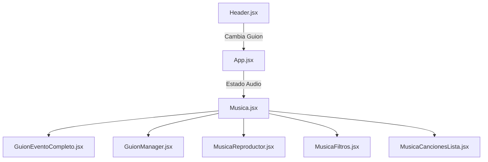
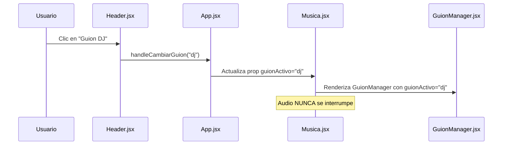
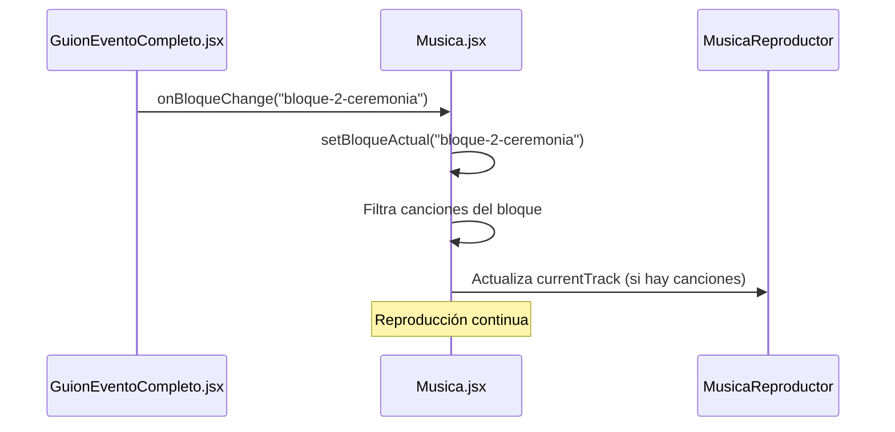

# Reproductor de Audio para Eventos - Documentación Actualizada

**Versión: 2.0** - Arquitectura Unificada con Musica.jsx como Componente Padre

---

## **🎯 OBJETIVO PRINCIPAL ACTUALIZADO**

Sistema completo de gestión musical y guiones para eventos que:
- **NUNCA interrumpe** la reproducción de audio durante la navegación
- **Unifica** reproductor y guiones en una sola experiencia
- **Proporciona** vistas especializadas para cada rol del evento
- **Mantiene** estado persistente durante toda la sesión

---

## **🏗️ ARQUITECTURA NUEVA - COMPONENTE PADRE ÚNICO**

### **Estrategia Implementada:**


### **🔑 Cambio Fundamental:**
- **`Musica.jsx`** es ahora el **componente padre** que contiene TODO
- **NUNCA se desmonta** - garantiza continuidad del audio
- Los guiones son **vistas internas** que cambian sin recrear el componente

---

## **🧩 COMPONENTES PRINCIPALES - ARQUITECTURA ACTUALIZADA**

### **1. `App.jsx`** - Estado Global Simplificado
**Función**:  
- Maneja solo el estado global de audio y navegación básica
- Pasa el control completo a `Musica.jsx`

**Estados Clave**:
```javascript
// Estados de Audio - PERSISTENTES
const [currentTrack, setCurrentTrack] = useState(null);
const [isPlaying, setIsPlaying] = useState(false);
const [volume, setVolume] = useState(0.7);

// Navegación Simple
const [guionActivo, setGuionActivo] = useState("completo");
```

**Comunicación**:
- → Header.jsx: Función para cambiar guiones
- → Musica.jsx: Todos los estados de audio + guion activo

---

### **2. `Musica.jsx`** - COMPONENTE PADRE DE TODO
**Función Principal**:  
- **Contenedor maestro** de todo el sistema reproductor + guiones
- **Maneja lógica completa** de música, bloques y sincronización
- **Renderiza condicionalmente** guiones dentro del mismo componente

**Estados Locales**:
```javascript
// Estados de Música y Bloques
const [bloques, setBloques] = useState({});           // Datos musicales JSON
const [bloqueActual, setBloqueActual] = useState("todo");
const [filteredSongs, setFilteredSongs] = useState([]);
const [GuionEventoCompleto, setGuionEventoCompleto] = useState(null); // Guión Evento Completo
const [estadosEvento, setEstadosEvento] = useState({});

// Referencias de Avance
const avanzarSiguienteCancion = useRef(() => {});
const avanzarSiguienteBloque = useRef(() => {});
```

**Lógica de Renderizado**:
```javascript
// SOLUCIÓN DEFINITIVA - Todo dentro de Musica
return (
  <div className="music-page">
    {/* Reproductor SIEMPRE visible */}
    <MusicaReproductor ... />
    
    {/* Dos columnas: Canciones + Guion */}
    <div className="music-content-section">
      <div className="music-songs-column">
        <MusicaFiltros ... />
        <MusicaCancionesLista ... />
      </div>
      
      <div className="evento-guion-column">
        {guionActivo === "completo" ? (
          // Guion con sincronización
          <GuionEventoCompleto ... />
        ) : (
          // Guiones especializados
          <GuionManager ... />
        )}
      </div>
    </div>
  </div>
);
```

---

### **3. `GuionEventoCompleto.jsx`** - Guión Evento Completo con Sincronización
**Función**:  
- Muestra el Guión Evento Completo del evento con **sincronización automática**
- Controla estados de bloques (Pendiente/En Progreso/Completado)
- Navegación integrada con la música

**Características**:
- ✅ Sincronización con bloques musicales
- ✅ Control de estados visual
- ✅ Exportación TXT
- ✅ Detalles expandibles por bloque

**Comunicación**:
- ← Recibe: `bloqueActual`, `GuionEventoCompleto`, `estadosEvento`
- → Envía: `onBloqueChange`, `onEstadoChange`

---

### **4. `GuionManager.jsx`** - Sistema de Guiones Especializados
**Función**:  
- Muestra **8 tipos diferentes** de guiones especializados
- Carga dinámica de archivos JSON según el rol
- Plantillas específicas para cada tipo de guion

**Guiones Disponibles**:
```javascript
const archivosGuiones = {
  completo: "/dataGuiones/guionEventoCompleto.json",
  dj: "/dataGuiones/guionDj.json",
  animador: "/dataGuiones/guionAnimador.json", 
  novios: "/dataGuiones/guionNovios.json",
  gastronomico: "/dataGuiones/guionGastronomico.json",
  decoracion: "/dataGuiones/guionDecoracion.json",
  fotografos: "/dataGuiones/guionFotografos.json",
  videoman: "/dataGuiones/guionVideoman.json",
  salon: "/dataGuiones/guionSalon.json"
};
```

**Plantillas Específicas**:
- **DJ**: Estilo musical, volumen, canciones sugeridas
- **Animador**: Anuncios, acciones
- **Novios**: Tareas específicas por persona
- **Gastronómico**: Servicio, personal, menú
- **Decoración**: Áreas de trabajo, preparación
- **Fotógrafos**: Momentos clave, equipamiento
- **Videoman**: Planos, equipos, ángulos
- **Salón**: Preparación, mobiliario, logística

---

### **5. `Header.jsx`** - Navegación Simplificada
**Función**:  
- Navegación entre diferentes guiones **sin interrumpir audio**
- Indicador visual del guion activo actual

**Cambio Principal**:
- ❌ Eliminado botón "Inicio" (redundante)
- ✅ Solo botones de guiones especializados
- ✅ Navegación instantánea

---

### **6. Componentes de Audio (Sin Cambios)**
- **`MusicaReproductor.jsx`** - Interfaz de controles de audio
- **`MusicaFiltros.jsx`** - Filtrado por bloques musicales  
- **`MusicaCancionesLista.jsx`** - Lista de canciones interactiva
- **`MusicaCancionItem.jsx`** - Item individual de canción

---

## **📂 ESTRUCTURA DE ARCHIVOS ACTUALIZADA**

```
src/
├── componentes/
│   ├── App.jsx                          # Estado global simplificado
│   ├── Musica.jsx                       # 🆕 PADRE DE TODO
│   ├── GuionEventoCompleto.jsx                  # Guión Evento Completo sincronizado
│   ├── GuionManager.jsx                 # 🆕 Sistema de guiones especializados
│   ├── Header.jsx                       # Navegación entre guiones
│   ├── MusicaReproductor.jsx            # Controles de audio
│   ├── MusicaFiltros.jsx                # Filtros de bloques
│   ├── MusicaCancionesLista.jsx         # Lista de canciones
│   ├── MusicaCancionItem.jsx            # Item de canción
│   ├── MusicaContexto.jsx               # Context (opcional)
│   ├── Footer.jsx                       # Pie de página
│   └── Contacto.jsx                     # Contacto
├── assets/scss/
│   ├── _01-General/
│   │   └── _App.scss                    # Estilos base
│   └── _03-Componentes/
│       ├── _Musica.scss                 # Estilos del componente padre
│       ├── _GuionEventoCompleto.scss            # Estilos Guión Evento Completo
│       ├── _GuionManager.scss           # 🆕 Estilos guiones especializados
│       ├── _Header.scss                 # Estilos header
│       └── ... [otros componentes]
└── main.jsx                             # Punto de entrada

public/
├── dataGuiones/                         # 🆕 CARPETA NUEVA
│   ├── guionEventoCompleto.json               # Guion maestro
│   ├── guionDj.json                     # Guion DJ
│   ├── guionAnimador.json               # Guion animador
│   ├── guionNovios.json                 # Guion novios
│   ├── guionGastronomico.json           # Guion gastronómico
│   ├── guionDecoracion.json             # Guion decoración
│   ├── guionFotografos.json             # Guion fotógrafos
│   ├── guionVideoman.json               # Guion videoman
│   └── guionSalon.json                  # Guion salón
├── audio/                               # Archivos de audio por bloques
│   ├── bloque-1-recepcion/
│   ├── bloque-2-ceremonia/
│   └── ... [19 bloques]
└── listaCancionesPorBloqueCompleto.json # Datos musicales
```

---

## **🔄 FLUJO DE DATOS ACTUALIZADO**

### **Navegación Entre Guiones:**


### **Sincronización Guión Evento Completo:**


---

## **🎯 FUNCIONALIDADES CLAVE ACTUALIZADAS**

### **1. 🎵 Audio Continuo Garantizado**
- **Problema Resuelto**: Los guiones ya NO recrean el componente Musica
- **Solución**: Guiones renderizados como vistas internas
- **Resultado**: Reproducción NUNCA se interrumpe

### **2. 🗂️ Sistema Unificado de Guiones**
- **Guión Evento Completo**: Sincronización con música + estados
- **Guiones Especializados**: Vista específica por rol
- **Navegación Instantánea**: Cambio inmediato entre vistas

### **3. 📊 Exportación y Compartición**
- **Todos los guiones** exportables en formato TXT
- **Copiado al portapapeles** para compartir fácilmente
- **Formato específico** para cada tipo de guion

### **4. 📱 Diseño Responsive Mejorado**
- **Mobile-first** con breakpoints optimizados
- **Dos columnas** en escritorio (canciones + guion)
- **Una columna** en móvil con navegación fluida

---

## **🔧 ESTRUCTURAS JSON - DOCUMENTACIÓN**

### **guionEventoCompleto.json** (Estructura Maestra)
```json
{
  "evento": "Guion Boda de Alejandro & Fabiola",
  "fecha": "23 de noviembre", 
  "horario": "19:00 a 04:00",
  "bloques": [
    {
      "id": "bloque-1-recepcion",
      "nombre": "Recepción Invitados",
      "horaInicio": "19:00",
      "horaFin": "19:30", 
      "actividades": ["Llegada de invitados.", "Recepción con comida..."],
      "detalles": "Música relajada. Código QR visible en entrada."
    }
  ]
}
```

### **guionDj.json** (Ejemplo Especializado)
```json
{
  "evento": "Guión DJ - Boda Alejandro & Fabiola",
  "fecha": "23 de noviembre 2025",
  "horario": "19:00 a 04:00", 
  "rol": "DJ",
  "responsable": "Selección musical y mezcla",
  "bloques": [
    {
      "id": "bloque-1-recepcion",
      "nombre": "Recepción Invitados",
      "horaInicio": "19:00",
      "horaFin": "19:30",
      "estilo_musical": "Música relajada instrumental",
      "volumen": "Bajo (30%)",
      "canciones_sugeridas": ["Jazz suave", "Bossa nova", "Instrumental"],
      "notas_tecnicas": "Transiciones suaves, evitar cortes bruscos"
    }
  ]
}
```

### **listaCancionesPorBloqueCompleto.json** (Datos Musicales)
```json
{
  "bloque-1-recepcion": {
    "bloque_musical": "Música de Recepción - Ambiente Relajado",
    "canciones": [
      {
        "id": "cancion-1-1",
        "nombre": "Canción Ejemplo",
        "artista": "Artista Ejemplo", 
        "duracion": "3:45",
        "url": "/audio/bloque-1-recepcion/cancion.mp3",
        "imagen": "/img/covers/cover.jpg"
      }
    ]
  }
}
```

---

## **🚀 MIGRACIÓN Y MANTENIMIENTO**

### **Para Agregar Nuevos Guiones:**
1. **Crear JSON** en `/public/dataGuiones/`
2. **Agregar entrada** en `archivosGuiones` de `GuionManager.jsx`
3. **Crear plantilla** en el renderizado de `GuionManager.jsx`

### **Para Modificar Comportamiento de Audio:**
- **Solo modificar** `Musica.jsx` (componente padre)
- **Estados persistentes** en `App.jsx`
- **Los guiones** son componentes de visualización solamente

### **Para Cambiar Estilos:**
- **Cada componente** tiene su archivo SCSS específico
- **Estrategia mobile-first** implementada
- **Breakpoints**: Tablet (768px), Escritorio (1024px)

---

